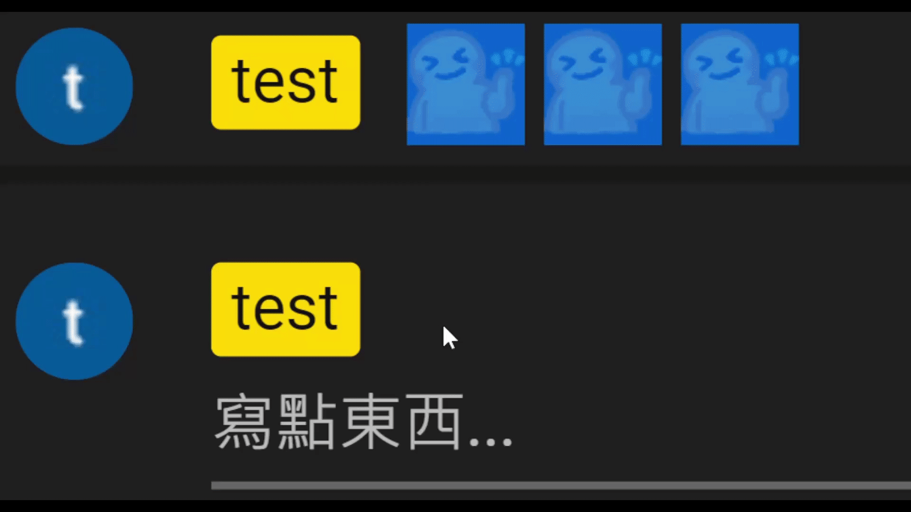
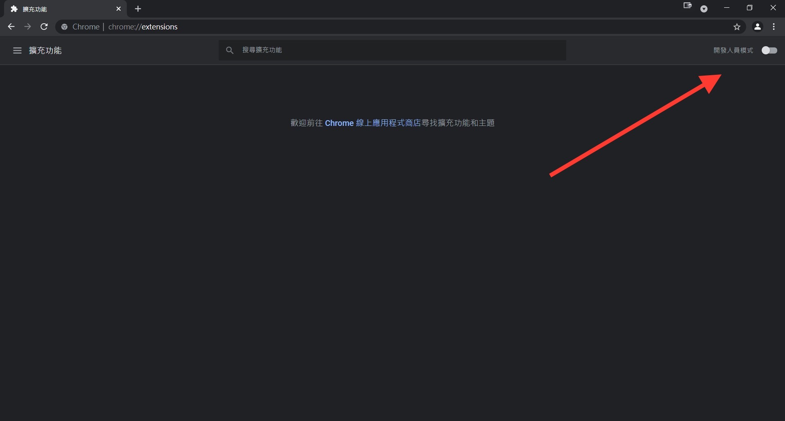
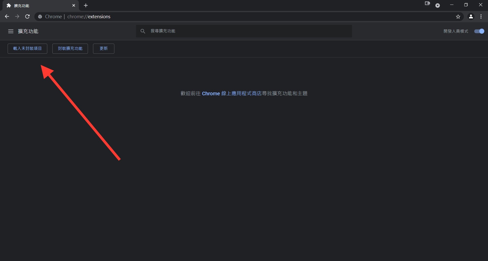
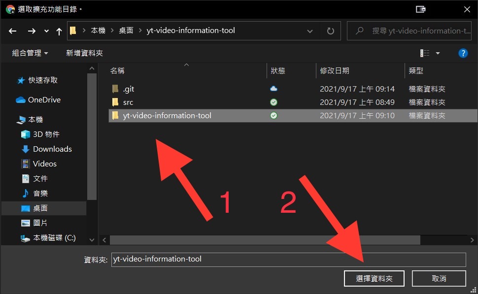
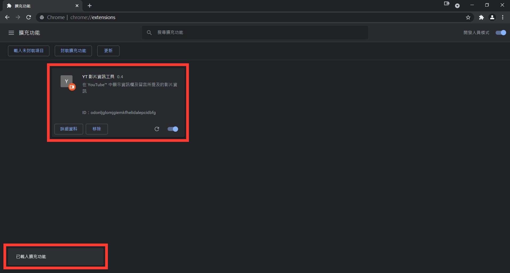

EN | [正體中文](./README_TW.md) | [简体中文](./README_CN.md)

# YT Live Chat Emoji Copy Tool

Make YouTube™ Live Chat's emoji can be copied.

## Demo

* Before using tool

    

* After using tool

    

## How to use

* Using Chrome Extension

    1. Download "[yt-live-chat-emoji-copy-tool.zip](./yt-live-chat-emoji-copy-tool.zip?raw=1)" and unzip it

    1. Go to [chrome://extensions/](chrome://extensions/)

    1. Open Developer mode

        

    1. Click「Load unpacked」

        

    1. Choose unzip folder

        

    1. Finish

        

* Using UserScript ([Tutorial form GreasyFork](https://greasyfork.org/en))

    1. Install a user script manager

    1. Download or open "[yt-live-chat-emoji-copy-tool.user.js](https://greasyfork.org/en/scripts/447599)"
